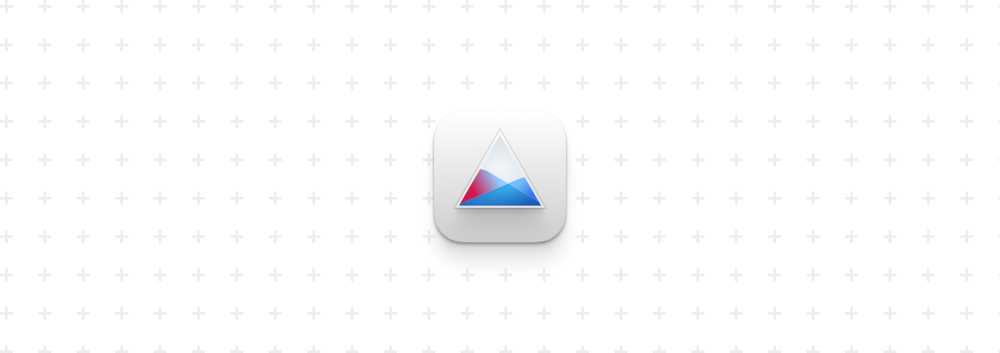

<div align="center">
  
  <h2>onedrive-vercel-index (Maintained Fork)</h2>
  <p>OneDrive public directory listing powered by Vercel + Next.js</p>
  <p>
    
    
    
    
  </p>
</div>

## Overview

This repository is a maintained and security-hardened fork of
[`spencerwooo/onedrive-vercel-index`](https://github.com/spencerwooo/onedrive-vercel-index),
updated to run on modern Vercel infrastructure and current dependencies.

Use it to:

- browse OneDrive files/folders with clean list/grid UI
- preview common file formats (image, markdown, code, Office, PDF, EPUB, video, audio)
- protect selected routes with password files
- search, paginate, and share raw links

## Project Updates

### 2026-04-21 (Major maintenance round)

- Upgraded runtime and framework stack:
  - Node.js `24.x`
  - Next.js `16.2.x`
  - React `19.x`
  - refreshed TypeScript / ESLint / i18n toolchain
- Migrated OAuth flow to server-side secret handling:
  - `OD_CLIENT_SECRET` now server env only
  - removed client-side reversible token obfuscation usage
- Added compatibility for legacy encrypted `OD_CLIENT_SECRET` values (for old deployments)
- Fixed SSR/runtime compatibility issues in preview components
- Fixed i18n runtime integration for `next-i18next` with Next.js 16
- Added explicit API input validation and method guards

### 2026-04-21 (Security hardening round)

- Added response security headers in `next.config.js`
  - `X-Content-Type-Options`
  - `X-Frame-Options`
  - `Referrer-Policy`
  - `Permissions-Policy`
  - `Cross-Origin-Opener-Policy`
  - `Strict-Transport-Security`
- Hardened OAuth callback code extraction validation
  - strict `origin + pathname` matching for redirect URL
- Added write-path protections for token setup endpoint
  - origin/referer trust checks
  - content-type validation
  - rate limiting
- Added search endpoint rate limiting
- Removed deprecated Tailwind line-clamp plugin usage/warning
- Patched dependency vulnerabilities with lock + overrides:
  - `@xmldom/xmldom` (high severity advisory fixed)
  - `cookie` (low severity advisory fixed)

### Audit status (as of 2026-04-21)

- `pnpm audit --prod`: **0 vulnerabilities**
- `pnpm audit`: **0 vulnerabilities**
- `pnpm lint`: pass
- `pnpm typecheck`: pass
- `pnpm build`: pass

## Quick Start (Vercel)

1. Fork this repository to your GitHub account.
2. Import the fork into Vercel.
3. Configure environment variables.
4. Deploy and complete the built-in OAuth bootstrap page (`/onedrive-vercel-index-oauth/step-1/`).

### Required environment variables

See `.env.example` for template.

```env
OD_CLIENT_ID=
OD_CLIENT_SECRET=
REDIS_URL=
KV_PREFIX=
NEXT_PUBLIC_USER_PRINCIPLE_NAME=
```

Notes:

- `OD_CLIENT_SECRET` must be the **secret value** from Azure App Registration, not the secret ID.
- OAuth redirect URI is fixed in code as `http://localhost`.
- `KV_PREFIX` is optional but recommended when sharing one Redis for multiple deployments.
- `NEXT_PUBLIC_USER_PRINCIPLE_NAME` should match the owner account used for initialization.

## Local Development

```bash
pnpm install
pnpm dev
```

Quality checks:

```bash
pnpm lint
pnpm typecheck
pnpm build
pnpm audit --prod
```

## Migration Notes (from old deployments)

1. Remove old hardcoded/obfuscated client secret settings.
2. Set `OD_CLIENT_ID` and `OD_CLIENT_SECRET` in Vercel.
3. Redeploy.
4. Re-run OAuth bootstrap if tokens are missing/expired.

## Credits

- Upstream project: [`spencerwooo/onedrive-vercel-index`](https://github.com/spencerwooo/onedrive-vercel-index)
- Original author: [Spencer Woo](https://spencerwoo.com)

## License

[MIT](LICENSE)

<div align="center">
  
</div>
